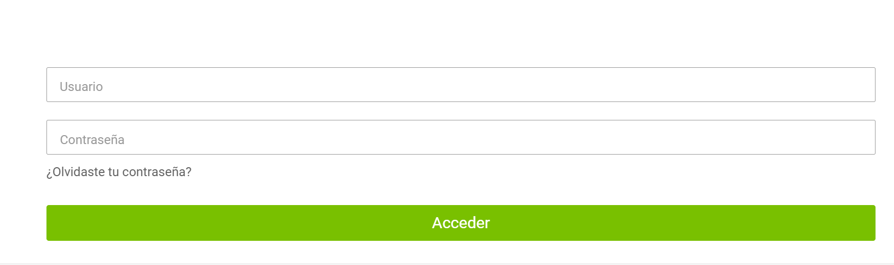
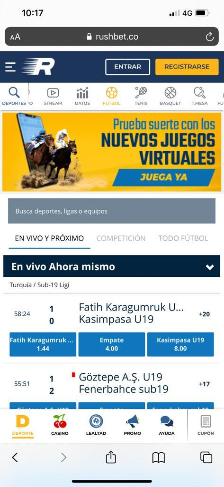

# FC Apuestas
## Laura Daniela Pachon Cuan

### Resumen 
Obtener rentabilidada y actividades adecuadas de la empresa FC apuestas ser reconocida como una empresa
confiabe y segura, ser lider en el mercado de las apuestas, brindarle a los usuarios facilidada dentro 
de la pagina web parera realizara apuestas.

En este proyecto Como usuario de FCapuestas de apuestas en linea se desea gerera rentabilidada de el dinero,
de acuerdo a las probabilidades que brindas los difrentes equipos,observando el resultado de sus anteriores partidos 
reconociendo el nivel en el que se encuentra el equipo, se logre visualizar los diferentes factores y 
tomara una decisión mas satisfactoria y logora decidir en cual partido se pueda invertir. 

En esta plataforma se pueden ver los equipos activos por los que se pueden realizara las apuestas.
Donde se puede interactuar con otros usuarios y dar sus opiniones sobre anteriores partidos y dar 
aproximaciones de los equipoas que tengas mas probabilidad de ganar.Permite entener un inicio de 
sesión rapido. Todos los usuarios que esten realizando sus apuestas podran observar los comentarios
que se realicen sobre los partidos y tenerlos en cuenta para tomar una decisión satisfactoria.

### Historias de Usuario 
 Como Usuario 
 quiero saber a que equipos de puede hacer una apuesta  
 Para poder ganas dinero
 
 Como administrador
 quiero saber cuales apuestas estas ativas y cuales ya cerraron
 para poder identificar las apuestas que ya no tienen valides  
 
 Como usuario 
 quiero saber la cantidades de usuarios que le han apostado a un equipo
 para poder decidir en cual depositar mi dinero 
  
 como administrador 
 quiero saber cuales son los comentarios del usuario 
 para poder tener en cuenta su opinion y mejorara ofreciendo una repuesta satisfactoria 
 
### 1 Chat con miembros de FCapuestas
 
 se puede observar las conversaciones entre los miembros de FCapuestas donde pueden dar 
 su punto de vista sobre los partidos que estan por jugarse.Estimación: valor 9. Criterios de
 aceptación : Registar su username y entara al partido que desea apostar.
 
### 2 Personas que entraron a la misma apuesta
 
 Se puede evidenciar cuantas personas han hecho sus apuestas a ese partido y el porcentaje
 de las apuestas que se han realizado a cada equipo.Estimación: valor 9. Criterio de aceptación: 
 Registar su username y estar dentro de una sala.
 
### 3 Se observan los partidos activos 
 
 El usuario pude ver que partidos se pueden realizar apuestas y que partidos ya se jugaron y cuales
 ya estan cerrados. Estimación: valor 5. Criterio de aceptación: Registar su username
 
### 4 Observar marcador 
 
 Se puede observar el marcador de los partidos anteriores que se han realizado entre esos dos equipos
 para que el usuario pueda visualizar esto y tome una decisión acertada.
 
### 5 leer mensajes anteriores
 
 Se puedan leer los mensajes que han hecho los otros usuarios dentro de la sala que estan los equipos
 a los que el usuario desea apostar.
 
 
  Esta Aplicación que utiliza Heroku para desplegar la sala de apuestas donde varios ususrios pueden interactuar entree ellos y 
 comunicarse para tomara una decisión optima para su apuesta 
[https://app-proyectoarsw.herokuapp.com/]
## Instrucciones de uso

* Java versión: 1.8.0

### Ejecución

En el sigiente lik de Github 
[https://github.com/2146013/ProyectoArsw.git]

podras encontarra la aplicacion de mi proyecto se encuentra en el gir como ProyectoArsw
para correr el proyecto puden usara mvn spring-boot:run,se abrira la ventana 
donde podra hablar e interactuar con otros usuarios haciedo uso de varias pantallas para apostar en la sala que desee

El tablero se corre en localhost:8080

## Tecnologias
* Maven
* Java
* Springboot
* Heroku
* React
* P5.js

## Autor
* Laura Daniela Pachon Cuan  - Fecha: 08/07/2021

## Licencia
This project is licensed under the MIT License - see the LICENSE file for details

